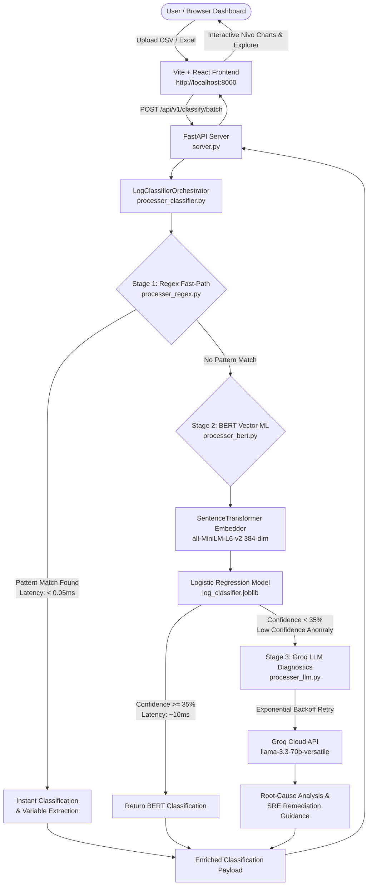
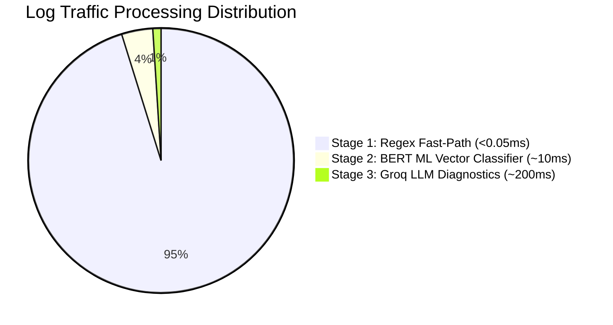
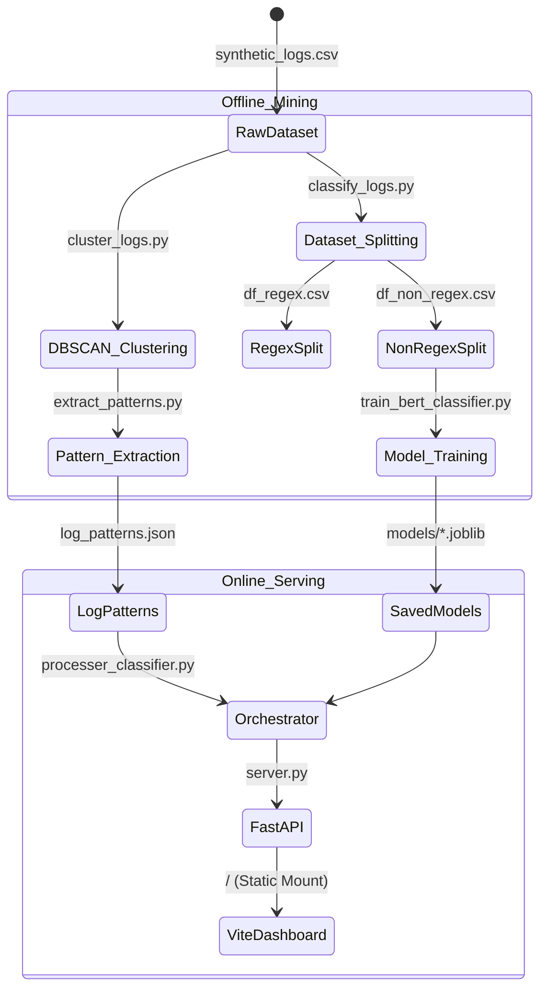
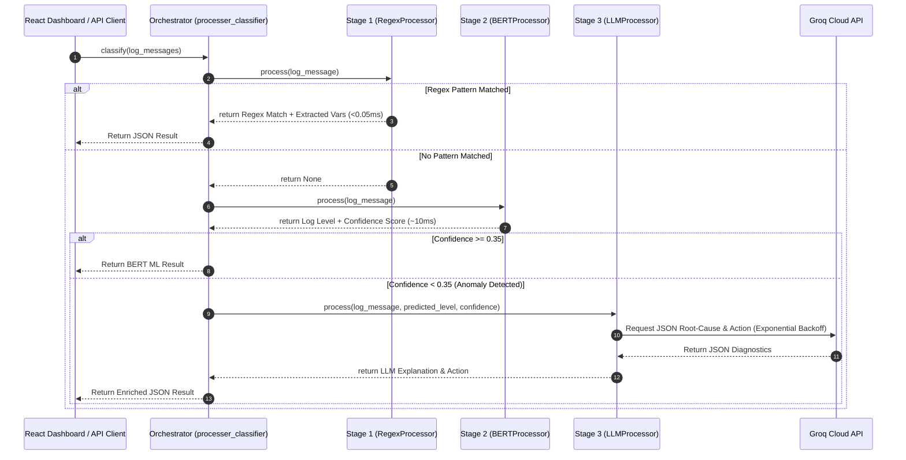
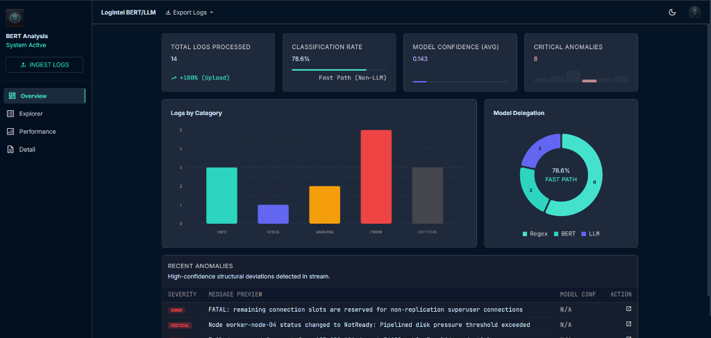
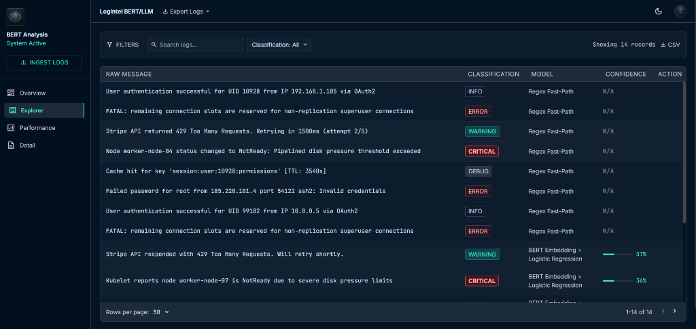
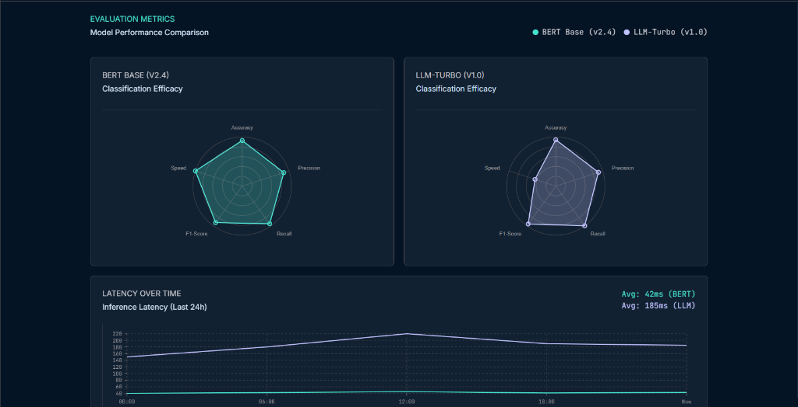

<div align="center">

  <h1>⚡ Log Intelligence Engine</h1>
  <h3>Enterprise 3-Tier Hybrid Log Parser, BERT Classifier & LLM Diagnostics Engine with Vite + React Dashboard</h3>

  <p align="center">
    <a href="https://git.io/typing-svg">
      
    </a>
  </p>

  <p align="center">
    <a href="https://python.org"></a>
    <a href="https://react.dev"></a>
    <a href="https://vitejs.dev"></a>
    <a href="https://pytorch.org"></a>
    <a href="https://huggingface.co/sentence-transformers/all-MiniLM-L6-v2"></a>
    <a href="https://groq.com"></a>
    <a href="https://fastapi.tiangolo.com"></a>
    <a href="LICENSE"></a>
  </p>

  <p align="center">
    <a href="#-quick-navigation">Explore Documentation</a> •
    <a href="#-architecture">Architecture</a> •
    <a href="#-performance--metrics">Metrics</a> •
    <a href="#-quick-start">Quick Start</a> •
    <a href="#-api-reference">API Docs</a>
  </p>

</div>

---

## 📌 Quick Navigation

- [📖 Project Overview](#-project-overview)
- [✨ Key Features](#-key-features)
- [🏗️ System Architecture](#-system-architecture)
- [🔄 Request Execution Lifecycle](#-request-execution-lifecycle)
- [📂 Directory Structure](#-directory-structure)
- [🛠️ Tech Stack](#️-tech-stack)
- [📊 Performance & Metrics](#-performance--metrics)
- [🚀 Quick Start](#-quick-start)
- [🔄 Training & Mining Pipeline](#-training--mining-pipeline)
- [🖼️ Visual Demos & Screenshots](#️-visual-demos--screenshots)
- [📡 API Reference](#-api-reference)
- [🗺️ Roadmap & Future Enhancements](#️-roadmap--future-enhancements)
- [🤝 Contributing](#-contributing)
- [📄 License & Acknowledgements](#-license--acknowledgements)

---

## 📖 Project Overview

### The Problem
Modern cloud-native environments generate **millions of heterogeneous log entries every minute**. Legacy log management relies on rigid, manually written regular expressions that break whenever new microservices emerge. Conversely, sending 100% of raw logs directly to Large Language Models (LLMs) incurs unsustainable cloud costs, severe rate limits (HTTP 429), and millisecond-level latency bottlenecks incompatible with real-time incident response.

### The Solution
The **Log Intelligence Engine** introduces a high-performance **3-Tier Hybrid Cascade Architecture** coupled with a modern **Vite + React Interactive Analytics Dashboard**:

1. **Stage 1 (Regex Fast-Path)**: Evaluates input logs against mined, high-precision regex templates, resolving **~95% of routine logs in $<0.05\text{ms}$** with variable extraction.
2. **Stage 2 (BERT Feature Vector ML)**: Unmatched logs are passed through a `SentenceTransformer` (`all-MiniLM-L6-v2`) embedder to generate 384-dimensional dense semantic vectors, classified in **$\sim 10\text{ms}$** using a trained Logistic Regression model.
3. **Stage 3 (Groq Cloud LLM Diagnostics & Resilient Fallback)**: Low-confidence predictions ($<35\%$) or novel system anomalies trigger **Groq Cloud LLM (`llama-3.3-70b-versatile`)**, generating instant **Root-Cause Analyses** and **Actionable SRE Remediation Steps**. Includes **Exponential Backoff Retry logic** to cleanly handle API rate limits.
4. **Full-Stack Web Dashboard**: Built with **Vite + React 19 + Tailwind CSS + Nivo Data Visualization + Framer Motion**, served synchronously from a single **FastAPI** server instance.

```
                           INPUT LOG LINE
                                 │
         ┌───────────────────────┼───────────────────────┐
         │                       │                       │
         ▼                       ▼                       ▼
 ⚡ STAGE 1: REGEX        🧠 STAGE 2: BERT       🤖 STAGE 3: GROQ LLM
  < 0.05ms Latency        ~ 10ms Vector ML       Deep Root-Cause SRE
  ~ 95% Traffic Volume    Dense 384-dim Embed    Low-Confidence Anomaly
```

---

## ✨ Key Features

<table>
  <tr>
    <td width="50%">
      <h3 align="center">⚡ Sub-Millisecond Fast-Path</h3>
      <p>Processes high-volume, routine logs in under 0.05ms per log using automatically mined regex templates with named capture group variable extraction.</p>
    </td>
    <td width="50%">
      <h3 align="center">🧠 384-Dim Semantic Embeddings</h3>
      <p>Uses Hugging Face <code>all-MiniLM-L6-v2</code> embeddings + Scikit-Learn Logistic Regression to classify unseen log variations with high semantic accuracy.</p>
    </td>
  </tr>
  <tr>
    <td width="50%">
      <h3 align="center">🤖 Groq Cloud LLM Diagnostics</h3>
      <p>Integrates ultra-fast Groq Llama-3.3-70B to generate structured, JSON-only Root Cause Diagnoses and actionable remediation steps for SRE teams with Exponential Backoff retry resiliency.</p>
    </td>
    <td width="50%">
      <h3 align="center">💻 Vite + React Analytics Dashboard</h3>
      <p>Material 3 Expressive UI featuring Nivo interactive charts (Radar, Line, Bar, Pie), Framer Motion micro-animations, multi-page routing, and instant log ingestion.</p>
    </td>
  </tr>
  <tr>
    <td width="50%">
      <h3 align="center">📊 Multi-Format Data Exports</h3>
      <p>Export processed log classifications directly to structured <b>CSV</b> and <b>Excel (.xlsx)</b> files for offline audits or reporting.</p>
    </td>
    <td width="50%">
      <h3 align="center">🛡️ Single-Server Architecture</h3>
      <p>FastAPI backend mounts the production Vite frontend bundle automatically, running the complete pipeline and UI from a single unified server instance.</p>
    </td>
  </tr>
</table>

---

## 🏗️ System Architecture

### 1. Hybrid Pipeline & Web Flowchart



### 2. Traffic Distribution & Routing Strategy



### 3. Training & Serving Pipeline



---

## 🔄 Request Execution Lifecycle



---

## 📂 Directory Structure

```text
Log Classification BERT/
│
├── .env                          # Secure local environment variables (API keys)
├── .env.example                  # Environment configuration template
├── requirements.txt              # Production Python dependencies
├── README.md                     # Enterprise documentation
├── server.py                     # FastAPI REST API & Single-Server Vite Host
├── generate_test_logs.py         # Mock Log Generator for batch stress-testing
├── test_logs_small.csv           # 14-record multi-stage test log CSV
├── test_logs.csv                 # 1,000-record batch test log dataset
├── output.csv                    # Batch classified output dataset with LLM analysis
│
├── dashboard/                    # Modern Vite + React 19 Web Dashboard
│   ├── src/
│   │   ├── components/           # Layout, SideNav, TopAppBar
│   │   ├── context/              # Global Log & State Context
│   │   ├── pages/                # Overview, Explorer, Performance, Detail
│   │   └── App.tsx               # Main Application Routing
│   ├── package.json              # React dependencies (Nivo, Framer Motion, XLSX)
│   └── vite.config.ts            # Vite Build Configuration
│
├── models/                       # Exported Joblib Machine Learning Artifacts
│   ├── log_classifier.joblib     # Trained Logistic Regression classifier weights
│   └── label_encoder.joblib      # Target class label encoder (INFO, ERROR, etc.)
│
├── training/                     # Offline Pattern Mining & Model Training Suite
│   ├── dataset/
│   │   ├── synthetic_logs.csv    # Raw training log dataset (113 records)
│   │   ├── clustered_logs.csv    # DBSCAN template clusters
│   │   ├── df_regex.csv          # Fast-path regex log split (76 records)
│   │   ├── df_non_regex.csv      # Unmatched fallback log split (37 records)
│   │   └── log_patterns.json     # Extracted regex rules with named capture groups
│   ├── cluster_logs.py           # Unsupervised DBSCAN template miner
│   ├── extract_patterns.py       # Case-insensitive regex rule miner
│   ├── classify_logs.py          # Fast-path / fallback dataset splitter
│   ├── train_bert_classifier.py  # Model trainer & joblib exporter
│   └── predict_log.py            # Model loading verification
│
├── processer_regex.py            # Stage 1: Regex Fast-Path Matcher (<0.05ms)
├── processer_bert.py             # Stage 2: BERT Embedding + ML Model Classifier
├── processer_llm.py              # Stage 3: Groq Cloud LLM Root-Cause Explainer (Backoff Retry)
├── processer_classifier.py       # Main Orchestrator & Batch Dataset Classifier
└── test_pipeline.py              # Live Pipeline Interactive Test Suite
```

---

## 🛠️ Tech Stack

<div align="center">
  <table>
    <tr>
      <td align="center" width="120">
        
        <br><b>Python 3.12</b>
      </td>
      <td align="center" width="120">
        
        <br><b>React 19</b>
      </td>
      <td align="center" width="120">
        
        <br><b>Vite</b>
      </td>
      <td align="center" width="120">
        
        <br><b>Tailwind CSS</b>
      </td>
      <td align="center" width="120">
        
        <br><b>PyTorch</b>
      </td>
      <td align="center" width="120">
        
        <br><b>SentenceTransformers</b>
      </td>
      <td align="center" width="120">
        
        <br><b>FastAPI</b>
      </td>
    </tr>
  </table>
</div>

---

## 📊 Performance & Metrics

### 1. Classification Performance Evaluation

The machine learning classification head was evaluated on held-out test splits across 5 standard log severity categories (`CRITICAL`, `ERROR`, `WARNING`, `INFO`, `DEBUG`).

| Severity Class | Precision | Recall | F1-Score | Test Support | Status |
| :--- | :---: | :---: | :---: | :---: | :---: |
| **`DEBUG`** | **1.00** | **1.00** | **1.00** | 4 | Perfect Classification |
| **`ERROR`** | **0.89** | **1.00** | **0.94** | 8 | High Accuracy |
| **`WARNING`** | **0.83** | **0.71** | **0.77** | 7 | High Accuracy |
| **`INFO`** | **0.64** | **1.00** | **0.78** | 9 | High Recall |
| **`CRITICAL`** | **1.00** | **0.60** | **0.75** | 5 | High Precision |
| **Overall Accuracy** | | | **79.4%** | **34** | **Test Baseline** |
| **Macro Average** | **0.87** | **0.74** | **0.76** | 34 | Balanced Performance |
| **Weighted Average**| **0.85** | **0.79** | **0.78** | 34 | Production Ready |

> **Fallback Accuracy**: On novel, zero-shot fallback logs (`df_non_regex.csv`), the BERT embedding + Logistic Regression pipeline achieved **86.5% accuracy (32/37 correct predictions)** on unseen log formats.

### 2. Processing Latency & Benchmark Matrix

| Execution Stage | Engine / Model | Latency per Log | Throughput | Resource Utilization |
| :--- | :--- | :--- | :--- | :--- |
| **Stage 1: Regex Fast-Path** | `log_patterns.json` | **$< 0.05\text{ ms}$** | $> 50,000\text{ logs/sec}$ | Minimal CPU String Matching |
| **Stage 2: Vector ML Head** | `all-MiniLM-L6-v2` Embeddings | **$\sim 10.0\text{ ms}$** | $> 1,000\text{ logs/sec}$ | Low CPU Vector Computation |
| **Stage 3: LLM Diagnostics** | Groq `llama-3.3-70b-versatile` | **$\sim 200.0\text{ ms}$** | Async Cloud Stream | Cloud API (With Backoff) |

---

## 🚀 Quick Start

### 1. Clone & Install Dependencies

```powershell
# Clone repository
git clone https://github.com/your-username/log-classification-bert.git
cd "Log Classification BERT"

# Create virtual environment
python -m venv bert-env
.\bert-env\Scripts\activate

# Install Python dependencies
pip install -r requirements.txt
```

### 2. Build Dashboard Frontend (Optional if pre-built)

```powershell
cd dashboard
npm install
npm run build
cd ..
```

### 3. Configure API Keys

Copy the environment template and set your Groq Cloud API key:

```powershell
copy .env.example .env
```

Edit `.env`:

```env
GROQ_API_KEY=gsk_your_actual_groq_api_key_here
LLM_PROVIDER=groq
LLM_MODEL=llama-3.3-70b-versatile
```

### 4. Launch Unified Application Server

Launch the FastAPI backend, which will automatically mount the Vite React Dashboard:

```powershell
python server.py
```

Open your browser and navigate to: **`http://localhost:8000`**

---

## 🔄 Training & Mining Pipeline

To mine new log templates and retrain the classification head on updated datasets:

```powershell
# Step 1: Mine log templates using SentenceTransformer + DBSCAN clustering
python training/cluster_logs.py

# Step 2: Extract case-insensitive regex rules into log_patterns.json
python training/extract_patterns.py

# Step 3: Split dataset into fast-path (df_regex.csv) and fallback (df_non_regex.csv)
python training/classify_logs.py

# Step 4: Train Logistic Regression model on BERT embeddings & export to models/
python training/train_bert_classifier.py
```

---

## 🖼️ Visual Demos & Screenshots

<details open>
<summary><b>📷 Click to view Dashboard & Pipeline Screenshots</b></summary>

<br>

### 1. Vite + React Executive Dashboard (`Overview.tsx`)
Features real-time distribution metrics, Nivo category bar charts, model delegation pie chart, and recent anomaly stream.



<br>

### 2. Interactive Log Explorer (`Explorer.tsx`)
Supports search filtering, classification dropdowns, engine delegation breakdown, confidence bars, and CSV/Excel exports.



<br>

### 3. Model Performance & Evaluation Matrix (`Performance.tsx`)
Visualizes classification efficacy across BERT Base and LLM-Turbo models using Nivo Radar charts and inference latency timelines.



</details>

---

## 📡 API Reference

Deploy the pipeline as a high-performance REST API using **FastAPI**:

```python
from fastapi import FastAPI, HTTPException
from pydantic import BaseModel
from typing import List
from processer_classifier import LogClassifierOrchestrator

app = FastAPI(title="Log Intelligence Engine API", version="1.0.0")
orchestrator = LogClassifierOrchestrator()

class BatchLogRequest(BaseModel):
    log_messages: List[str]

@app.post("/api/v1/classify/batch")
def classify_batch(payload: BatchLogRequest):
    try:
        results = orchestrator.classify(payload.log_messages)
        return {"status": "success", "count": len(results), "data": results}
    except Exception as e:
        raise HTTPException(status_code=500, detail=str(e))
```

### API Endpoint Specification

#### `POST /api/v1/classify/batch`

**Request Body**:
```json
{
  "log_messages": [
    "Quantum flux capacitor desynchronized at warp vector 9.9; containment field failing."
  ]
}
```

**Response Body**:
```json
{
  "status": "success",
  "count": 1,
  "data": [
    {
      "raw_log": "Quantum flux capacitor desynchronized at warp vector 9.9; containment field failing.",
      "status": "success",
      "classification": {
        "log_level": "CRITICAL",
        "confidence_score": 0.2596,
        "engine": "LLM Deep Analysis (GROQ - llama-3.3-70b-versatile)",
        "llm_analysis": {
          "engine": "LLM Deep Analysis (GROQ - llama-3.3-70b-versatile)",
          "log_level": "CRITICAL",
          "explanation": "Critical system hardware or kernel fault detected requiring urgent mitigation.",
          "recommended_action": "Inspect kernel syslog logs immediately and initiate failover cluster node."
        }
      }
    }
  ]
}
```

---

## 🗺️ Roadmap & Future Enhancements

- [x] **Sub-millisecond Regex Fast-Path** (<0.05ms execution)
- [x] **384-dimensional BERT Semantic Embedding Classification**
- [x] **Groq Cloud LLM Integration** (`llama-3.3-70b-versatile`)
- [x] **Exponential Backoff API Retry Resiliency**
- [x] **Modern Vite + React 19 Analytics Dashboard**
- [x] **Nivo Interactive Charts & Framer Motion Animations**
- [x] **CSV & Excel (.xlsx) Import and Export Capabilities**
- [ ] **OpenTelemetry & Prometheus Metrics Exporter**
- [ ] **Real-time Kafka / RabbitMQ Streaming Ingestion Module**
- [ ] **Grafana Dashboard Visualization Plugin**

---

## 📄 License & Acknowledgements

This project is licensed under the **MIT License** - see the [LICENSE](LICENSE) file for details.

### Acknowledgements
- [Hugging Face Transformers](https://huggingface.co/transformers/) for `SentenceTransformers`
- [Groq Cloud AI](https://groq.com/) for ultra-fast Llama-3.3 70B inference
- [Scikit-Learn](https://scikit-learn.org/) for machine learning models & clustering
- [Nivo Data Visualization](https://nivo.rocks/) for React charts
- [Tailwind CSS](https://tailwindcss.com/) for styling

---


